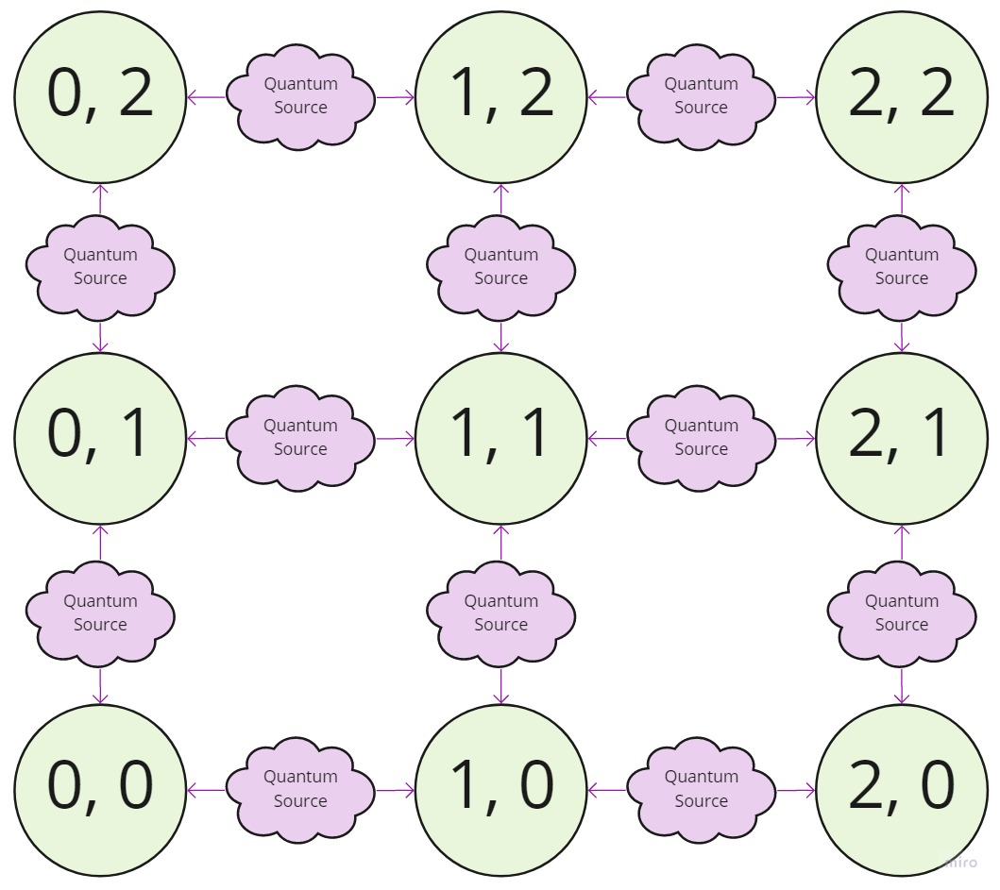

# Quantum Cryptography applied in Quantum Networks
Design of a Quantum Network with Quantum Key Distribution protocols

_by D-Cryp7_

## Implementations
### BB84
#### Simple BB84
BB84 Protocol for Quantum Key Distribution in a 2-node Quantum Network . It creates a single Quantum Channel (unidirectional) and two Classsical Channels (bidirectional) with the respective Callback Functions.

Diagram of the Quantum Network:

_ref: https://github.com/h-oll/netsquid-private/blob/master/BB84/BB84.py (adapted by D-Cryp7 for Netsquid 1.1.6)_

### Ekert
#### Basic Entanglement
Generation of entanglement between 2 qubits using Quantum Gates for the Ekert Protocol. Next, the idea is to create a Quantum Network with that QKD Protocol.  
_ref: https://qiskit.org/textbook/ch-gates/multiple-qubits-entangled-states.html (adapted by D-Cryp7 for Netsquid 1.1.6)_  

#### 3-node Entanglement Swapping
Implementation of Ekert Protocol in a 3-node Quantum Network using Quantum Repeater for the Entanglement Swapping. The resulting qubits for Alice and Bob are evaluated through a fidelity function, verifying that both qubits are entangled. After that we can create the shared key and encrypt messages with classical cryptography.  
_ref: https://docs.netsquid.org/latest-release/learn_examples/learn.examples.repeater.html (adapted by D-Cryp7 for Netsquid 1.1.6)_  

#### $n$ x $n$-Quantum Network with Entanglement Swapping
This implementation uses the Ekert Protocol for Quantum Key Distribution in a $n$ x $n$ grid Quantum Network. After the Quantum Network is defined, the simulation starts dynamic protocols depending on the connection requirements.  

Diagram of the Quantum Network:

where each link consists of a bidirectional quantum and classical channel with a fibre depolarize model for noise simulation. Each node has a quantum processor and ports depending of their neighbours.

_refs_: 
* https://docs.netsquid.org/latest-release/learn_examples/learn.examples.repeater_chain.html 
* https://docs.netsquid.org/latest-release/learn_examples/learn.examples.repeater.html 
* Evan Sutcliffe, Matty J. Hoban & Alejandra Beghelli - Multipath Routing for Multipartite State Distribution in Quantum Networks  

##### Limitations:
* ~~Routes of two nodes doesn't work yet. The aim of this implementation is for testing the entanglement swapping.~~ **SOLVED**: Routes of two nodes are available for analysis.
* ~~Some routes doesn't work, i don't know why because i didn't found a public quantum network implementation in Netsquid, so there's no validation yet.~~ **SOLVED**: Any path can be entangled in the quantum network.
* ~~The quantum network needs to be reset for each traffic because of a ProcessorBusyError on defining the Swap and Correct protocols of each node. Maybe it's necessary to create a quantum processor for each link.~~ **WIP**: The implementation can entangle more than one path in the same simulation, if and only if they are disjunctive.

We hope to fix this limitations in future updates.  

_(adapted by D-Cryp7 for Netsquid 1.1.6)_  

## References
* https://github.com/h-oll/netsquid-private/tree/a894c7c8b1dfc60e70171493991e9cc4f9ac12d3
* https://github.com/FerjaniMY/Quantum_Computing_resources
* https://netsquid.org
* https://qiskit.org
